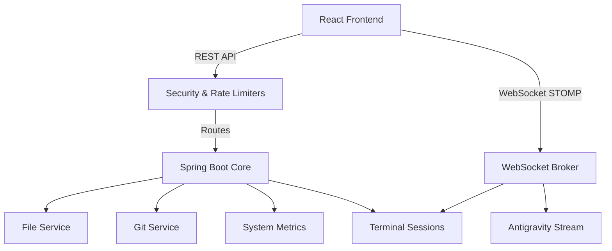

# Architecture & Design Manual

## System Overview

Mac Bridge is structured as a two-tier application:

1. **Local Agent (Backend)**: A Spring Boot application running on the managed Mac. It acts as the local system orchestrator, running terminal processes, reading/writing files, querying macOS system stats, and interfacing with local resources like Git or the Antigravity Python CLI.
2. **Client Console (Frontend)**: A React Single Page Application compiled with Vite. It interacts with the backend agent over HTTP (REST API) and WebSockets (STOMP protocol) for real-time logs and terminal output.

## Security Model

### JWT + Refresh Tokens
- **Initial Auth**: The client exchanges credentials for a short-lived access JWT (valid 1 hour) and a long-lived device-specific refresh token (valid 30 days).
- **Rotation**: The client intercepts `401 Unauthorized` responses, calls `/api/auth/refresh` using the refresh token, updates the access token in Zustand, and transparently retries the failed request.
- **Persistence**: To survive restarts without logging out, signing keys and refresh tokens are persisted in `~/.mac-bridge/`.

### File Security & Sandboxing
- All file operations must be validated against `validatePath()`.
- Home directory expansion (~ -> `/Users/username`) is performed.
- Standard normalization resolves relative parent paths (`..`) and checks that the resolved absolute path starts with `/Users/username/`. Path traversal attempts outside this boundary are blocked immediately and return a `403 Forbidden` status.

### Command Whitelisting vs. Full Access
- **SAFE Mode**: Terminal commands are verified against a whitelist. Chaining, redirecting, and command injection characters (e.g. `;`, `&&`, `|`) are blocked.
- **FULL Mode**: Safe validation is bypassed. The agent runs commands as-is (e.g. for complete shell sessions). Configured via `bridge.terminal.mode=FULL`.

## State & Data Sync

- **Zustand**: Manages local frontend state (active session IDs, dynamic baseURLs, JWT lifecycle, tunnel discovery configs).
- **WebSockets (STOMP)**: Handles low-latency streaming:
  - `/topic/terminal/{sessionId}`: Real-time stdout/stderr from active processes.
  - `/topic/antigravity/{sessionId}`: Streaming tokens from the Antigravity LLM.
